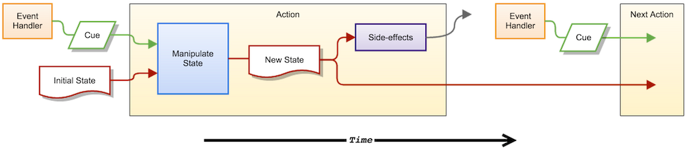

# LoFlux is not another framework

It's not even a library (yet).

It a simple idea, inspired by the uni-directional data flow concept from Flux, and that the presentation is a pure
function of the application state.

Firstly don't get me wrong, I like the idea of Flux and React, but they both feel overly complex to me, and it doesn't
seem clear where asynchronous requests fit in.

So I started thinking about data flow, representation of state, asynchronous requests and side effects.

I started to think of it as a game.

## The state of play

There is a state of play, a player can manipulate that state of player, and a spectator/commentator observes that state
and can report on it.

The player is a pure function, which is given a cue (eg. from an event) and the current state of play, and returns a
new state of play.

(The player may in fact be a whole chain of plays, passing a new state to one another)

If the state has changed the spectator is passed the modified state from the player, and may perform any necessary
side-effects, but it MUST NOT modify the state.

The side-effects may be rendering to the DOM, or performing an async request, calling a web-worker, or setting a timeout
to perform another *action*.

The whole *action* described above occurs purely within a distinct period of the event loop (TODO: is there a name for this?),
as the following diagram shows:

Time runs from left to right, rectangles are code, green lines are the payload/cue/stimulus from events, red lines are
the flow of state data.

## The action

You may have noticed the term *action* used above, an *action* is a function that:

* was created with a player, and spectator
* is called with a cue (some parameters for the player)
* fetches the current state
* calls the player with the cue and state
* checks the whether the new state returned from the player differs to the original state, and if so...
    * stores the new state
    * calls the spectator with the new and old state

The player is a pure referentially transparent function, it uses data only from its arguments, ie. the cue and state,
and returns either the same state or a new state (state is immutable btw). It must NEVER perform side-effects;
no DOM manipulation, no async requests, no timeouts, no mutation of any external data, and must not call another *action*.

The spectator is passed the new state and old state, but not the cue. It can, in contrast to the player, perform any
type of side-effect it wishes, but must not modify the state given to it or attempt to directly call another *action*.
Although it may set a timeout to call another *action*.

This leaves us with the question of where we store state between *actions*...

## The locker

This is an object that holds an immutable state, it is passed into the *action* which will *claim* the state, *swap* in
the new state, and *release* it after all side-effects have executed.

When the state is *claimed* from the *locker* it is locked, so no other *action* can claim it - an error is thrown if
attempted. This prevents *actions* from being nested, ie. called by players or spectators.

The *release* at the end of the *action* will unlock it, allowing another *action* to execute.

## The round

Passing the locker and cue, and player, and spectator into every *action* would be quite tedious. So instead we have
the *round*, which will help us create an *action factory* to create *actions*.

A *round* is a function that:

* is created from a locker, spectator and player
* accepts the cue as its parameters
* claims the current state from the locker
* calls a player with the cue and state
* checks the whether the new state returned from player differs to the original state, and if so...
    * swaps the new state into the locker
    * calls a spectator with the new state and old state
* releases the locker

The *round* constructor function can be partially applied given a locker and spectator to create an *action factory*.
This provides a very convenient way to create new actions that pull the same state and perform the same side-effects
but have a unique player (ie. state manipulation).

## The name

LoFlux is a lower level flux. (Suggestions for a better name are very welcome)

## The code

I'd recommend perusing the code in the following order:

* loflux/src/locker.ts - for the basic operation of the locker
* loflux/src/round.ts - for the implementation of the round
* examples/react/src/init.ts - to see how an *action factory* is created
* examples/react/src/actions.ts - to see how actions are created using this factory
* examples/react/src/*.jsx - to see how actions are called from event handlers

Also, the jasmine tests may help in understanding the behaviours.

## The design

You may have noticed, there is very little in the way of OO design here - this is entirely intentional.

I've intended this to be a low level idea built around functional concepts. I'd expect anyone using LoFlux to
build their own *HiFlux* (ie. Higher level flux) on top, using whatever libs and programming paradigm you prefer.

## The utilities

You may have noticed the utils directory, and the usage of these throughout the examples. These are simple utility
functions, provided here to avoid depending on any particular library - although I'd recommend using your preferred
utility lib instead, eg Underscore, Lodash, Ramda, etc rather than these in practice.

## The future

I hope to add:

* documentation within the code
* examples using alternative libraries
* demonstrations of different side-effects
* ways to delegate to and register side-effects
* a better build
* ES6 modules when Typescript 1.5 is released
